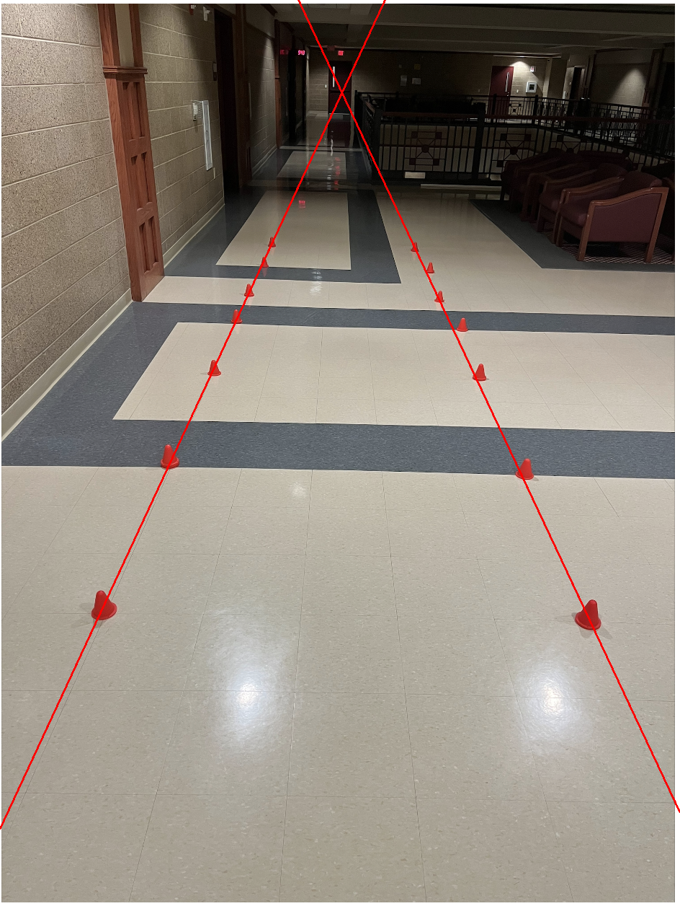

# WA-Perception-Team-Challenge
Perception Team Coding challenge for Wisconsin Autonomous 

# Libraries Used
I utilized CV2 and Numpy. CV2 was effective for alot of the image processing. Numpy was effective for the math. Plenty of documentation and YouTube videos on both. 

# Methodology
This challenge was fun and required me to figure out some unique ways to solve the different sub-problems that came with it. Originally, I was going to use a pre-trained data library of COCO objects. I found one from the TensorFlow Detection Model Zoo that was lightweight but accurate enough for this problem. I then realized that the objects it was trained on did NOT include any sort of 'orange cones' or 'traffic cones'. So I opted for a method of color-based detection. After some research and fine tuning of the color paremeters, I figured out how to grab the orange clusters ( or contours) of only the cones and establish an array of their center points. Then I used basic algebra math to grab the first and last cones of each side, make a slope, and extend a line between the two throughout the screen. I was forced to come up with a solution as well for the cases in which the line could enter or exit through either the top, bottom, left, or right of the screen. After getting through these problems, a line of fit was succesfully drawn and saved as 'answer.png'

# answer.png 

# What Did and Did Not Work 
Throughout this problem I tried a few different strategies to find what works. 

I found that color based detection of the cones was the easiest way to recognize the cones for this problem. It probably is not the most robust but other models would have required training my own custom dataset with hundreds-thousands of images. 

I had to fine tune the color and area paremeters, to only capture the cones, and the large boxes around them. I found that some other shades of orange were orginally identified as well as on the cones there would be little specs that were recognized. I had to tune the paremeters to weed these out. 

My biggest problem was dealing with the lines potentially exiting (the bottom) of the screen through either the side or the bottom. If they only went through the bottom my lines would be too far in, but I wanted to allow for both to be robust. I had to devise a way to check the numbers of my starting and ending values to check for this and construct the correct lines. 
